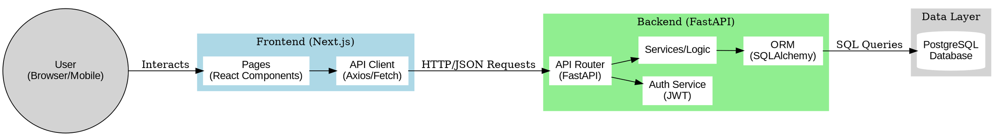
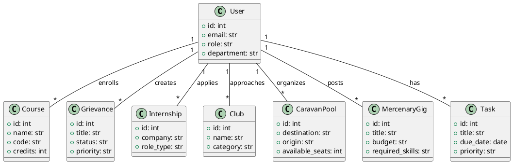
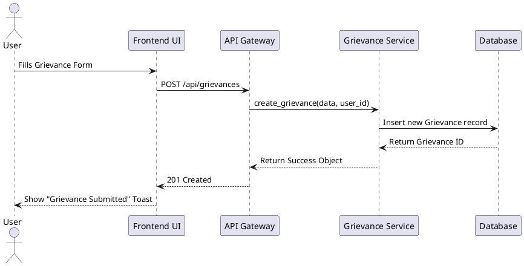

# System Architecture and UML Diagrams

## 1. System Architecture (DOT Code)

This DOT code represents the high-level architecture of the application, showing the interaction between the Frontend (Next.js), Backend (FastAPI), and Database.

## 2. Comprehensive Database Entity Relationship Diagram (PlantUML)

This PlantUML code details the complete database schema with all 18 models found in the backend.

```plantuml
@startuml
!theme plain
hide circle
skinparam linetype ortho

entity "User" as users {
  *id : Integer
  --
  email : String
  role : String
  department : String
}

entity "AcademicEvent" as academic_events {
  *id : Integer
  --
  title : String
  event_date : Date
  event_type : String
  course_id : Integer <<FK>>
  created_by : Integer <<FK>>
}

entity "Announcement" as announcements {
  *id : Integer
  --
  title : String
  category : String
  posted_by : Integer <<FK>>
}

entity "Attendance" as attendance {
  *id : Integer
  --
  student_id : Integer <<FK>>
  course_id : Integer <<FK>>
  date : Date
  status : String
}

entity "AuditLog" as audit_logs {
  *id : Integer
  --
  user_id : Integer <<FK>>
  action : String
  target_type : String
}

entity "CaravanPool" as caravan_pools {
  *id : Integer
  --
  destination : String
  origin : String
  posted_by : Integer <<FK>>
  status : String
}

entity "MercenaryGig" as mercenary_gigs {
  *id : Integer
  --
  title : String
  category : String
  posted_by : Integer <<FK>>
  assigned_to : Integer <<FK>>
  status : String
}

entity "Club" as clubs {
  *id : Integer
  --
  name : String
  lead_id : Integer <<FK>>
}

entity "ClubMember" as club_members {
  *id : Integer
  --
  club_id : Integer <<FK>>
  user_id : Integer <<FK>>
  role : String
}

entity "ClubEvent" as club_events {
  *id : Integer
  --
  club_id : Integer <<FK>>
  title : String
  event_date : DateTime
}

entity "Course" as courses {
  *id : Integer
  --
  name : String
  code : String
  faculty_id : Integer <<FK>>
}

entity "Enrollment" as enrollments {
  *id : Integer
  --
  student_id : Integer <<FK>>
  course_id : Integer <<FK>>
}

entity "ForumPost" as forum_posts {
  *id : Integer
  --
  title : String
  category : String
  author_id : Integer <<FK>>
}

entity "ForumComment" as forum_comments {
  *id : Integer
  --
  post_id : Integer <<FK>>
  author_id : Integer <<FK>>
  content : Text
}

entity "Grievance" as grievances {
  *id : Integer
  --
  title : String
  category : String
  submitted_by : Integer <<FK>>
  assigned_to : Integer <<FK>>
  status : String
}

entity "GrievanceComment" as ipv_comments {
  *id : Integer
  --
  grievance_id : Integer <<FK>>
  user_id : Integer <<FK>>
  content : Text
}

entity "Incident" as incidents {
  *id : Integer
  --
  user_id : Integer <<FK>>
  description : String
  status : String
}

entity "Internship" as internships {
  *id : Integer
  --
  title : String
  company : String
  posted_by : Integer <<FK>>
}

entity "Application" as internship_apps {
  *id : Integer
  --
  student_id : Integer <<FK>>
  internship_id : Integer <<FK>>
  status : String
}

entity "Location" as locations {
  *id : Integer
  --
  name : String
  category : String
  latitude : Float
  longitude : Float
}

entity "LostFoundItem" as lost_found {
  *id : Integer
  --
  title : String
  item_type : String
  posted_by : Integer <<FK>>
  claimed_by : Integer <<FK>>
  status : String
}

entity "Resource" as resources {
  *id : Integer
  --
  title : String
  resource_type : String
  uploaded_by : Integer <<FK>>
}

entity "Task" as tasks {
  *id : Integer
  --
  title : String
  status : String
  user_id : Integer <<FK>>
}

' Relationships
users ||..o{ academic_events : "creates"
users ||..o{ announcements : "posts"
users ||..o{ attendance : "has"
users ||..o{ audit_logs : "triggers"
users ||..o{ caravan_pools : "organizes"
users ||..o{ mercenary_gigs : "posts/completes"
users ||..o{ club_members : "joins"
users ||..o{ forum_posts : "authors"
users ||..o{ forum_comments : "comments"
users ||..o{ grievances : "submits/handles"
users ||..o{ ipv_comments : "comments on"
users ||..o{ incidents : "reports"
users ||..o{ internship_apps : "applies"
users ||..o{ lost_found : "reports/claims"
users ||..o{ resources : "uploads"
users ||..o{ tasks : "manages"
users ||..o{ enrollments : "enrolls"

courses ||..o{ academic_events : "has"
courses ||..o{ attendance : "records"
courses ||..o{ enrollments : "has students"
courses }o..|| users : "taught by"

clubs ||..o{ club_members : "has members"
clubs ||..o{ club_events : "hosts"
clubs }o..|| users : "led by"

forum_posts ||..o{ forum_comments : "has"

grievances ||..o{ ipv_comments : "has"

internships ||..o{ internship_apps : "receives"

@enduml
```

## 3. Class Diagram (PlantUML)

Representation of the core backend classes.

## 4. Sequence Diagram (PlantUML)

Example flow: User submitting a grievance.

