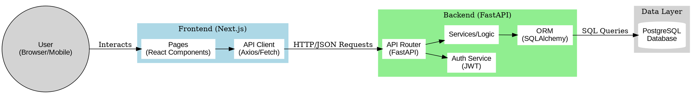
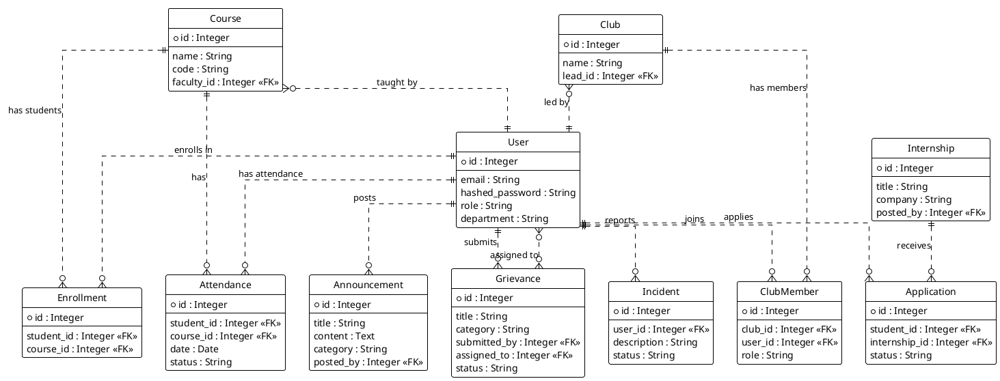
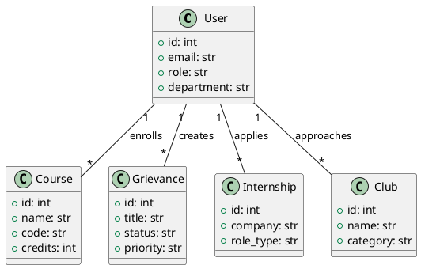
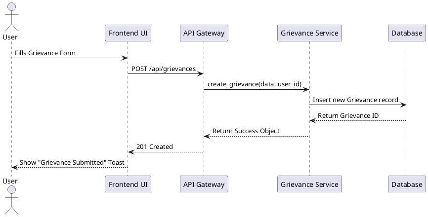

# System Architecture and UML Diagrams

## 1. System Architecture (DOT Code)

This DOT code represents the high-level architecture of the application, showing the interaction between the Frontend (Next.js), Backend (FastAPI), and Database.

## 2. Database Entity Relationship Diagram (PlantUML)

This PlantUML code details the database schema based on the SQLAlchemy models found in `backend/app/models/`.

## 3. Class Diagram (PlantUML)

Representation of the core backend classes.

## 4. Sequence Diagram (PlantUML)

Example flow: User submitting a grievance.

